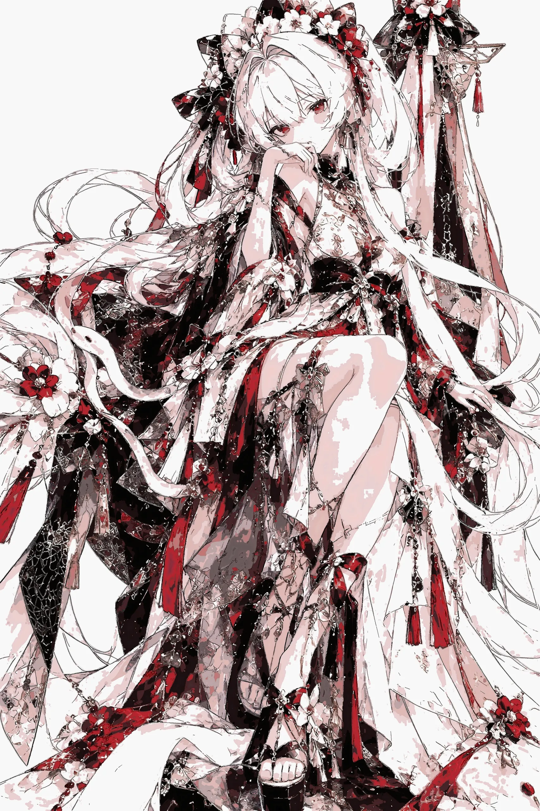
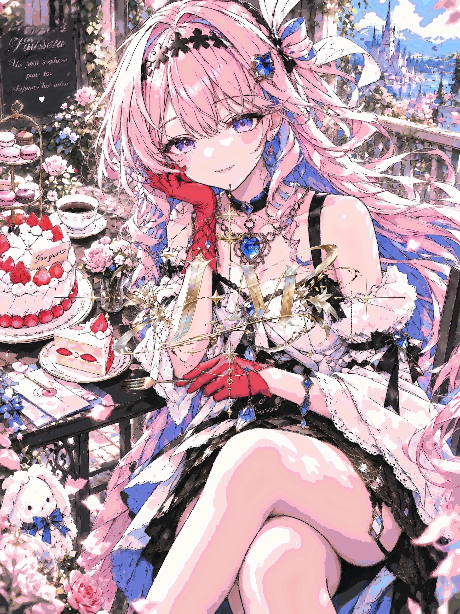
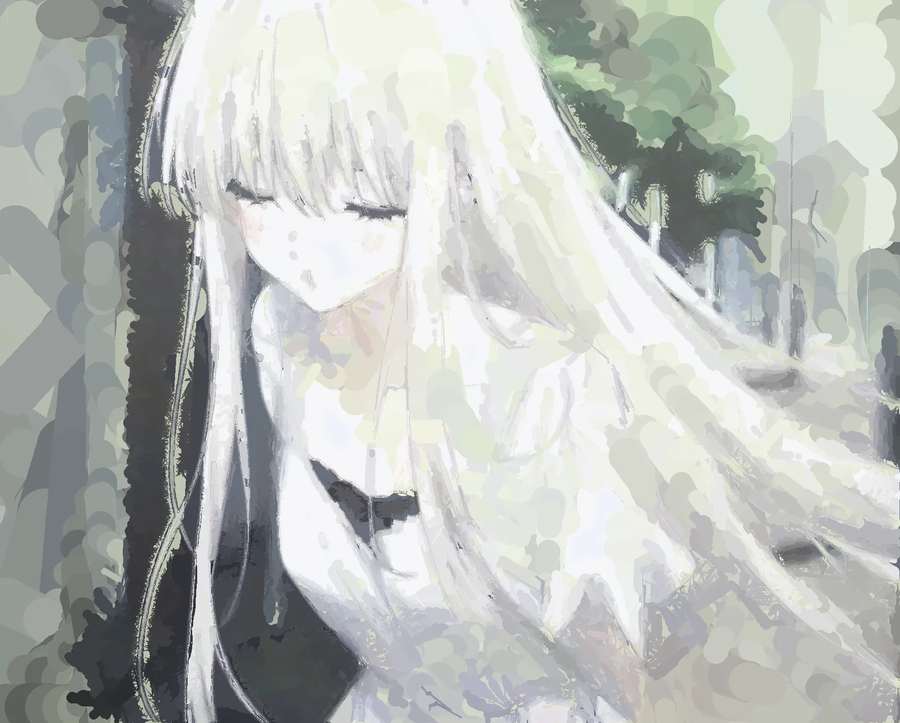
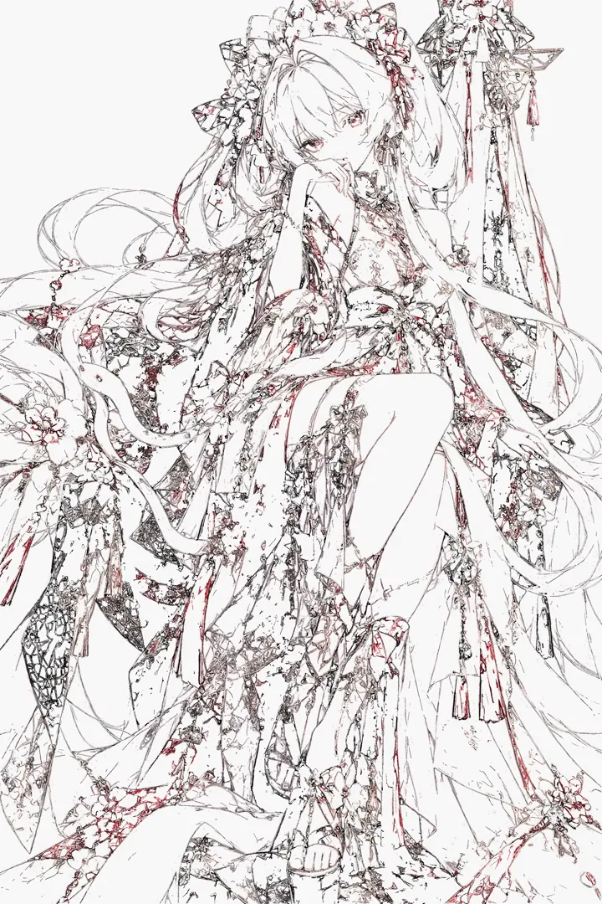

<div align="center">

<picture>
  <source media="(prefers-color-scheme: dark)" srcset="assets/brand_daub.png" />
  
</picture>

**Deterministic stroke rendering — a catalog of brush strokes in, a finished painting out.**

*Pure Rust · zero runtime dependencies · PNG · layered .KRA · layered .PSD · reveal video*

<!-- CI badge: re-add when the repo goes public — shields.io can only
     see public repos, so on a private repo it renders "not found".
[](https://github.com/directwire/daub/actions)
-->
[](#quick-start)
[](#the-plan-contract)
[](#mcp-for-agents)
[](LICENSE)

<br/>



*«红白姬 · Red-and-White Hime» — every pixel laid down stroke by stroke: 303,843 calibrated strokes · 10 layers · one plan file, rasterized by daub.*

<br/>

[Gallery](#gallery) · [Watch it paint](#watch-it-paint) · [Performance](#performance) · [Quick start](#quick-start) · [MCP](#mcp-for-agents) · [License](#assets-and-license)

</div>

---

## Overview

**daub** is a deterministic stroke renderer. Feed it a *plan* — a JSON catalog of pressure-tagged brush strokes — and it rasterizes a finished painting in sub-second time, exporting PNG, layered `.kra` (Krita), layered `.psd` (Photoshop / Clip Studio / Affinity) and a stroke-by-stroke reveal video. Pure Rust, no third-party runtime dependencies, byte-for-byte reproducible: the same plan renders the same painting on any machine.

Rendering is a **standard pass**. The output of any image pipeline — AI or human — is just input material. What daub adds is what the generative model can't give you: **the craft of calibrated strokes · a replayable painting process · layered files you can keep editing.**

> **Note — bring your own planner.** This repository ships the renderer only; the image→plan half is not included. Any planner that emits the plan contract below works out of the box (see [The plan contract](#the-plan-contract)).

**中文简述：** **daub** 把「笔画目录」（plan JSON：一组带压感的笔画）亚秒级光栅化成完整画作，一次产出 PNG、分层 .kra、分层 .psd 与揭示视频。纯 Rust、零第三方运行时依赖，同一份 plan 任何机器逐字节相同。渲染是标准工序——任何生图流程的输出都是输入原料，daub 补上生成模型给不了的三样：**校准笔触的工序感 · 可回放的作画过程 · 可继续编辑的分层工程文件。**

---

## Gallery

<p align="center">
  <em>All paintings are daub output. Placard counts are read from each plan file — canvas · strokes · layers.</em>
</p>

<br/>

<table>
  <tr>
    <td align="center" width="50%">
      <br />
      <sub>«红妆落花 · Falling Blossoms»<br />3664 × 3664 · 340,955 strokes · 10 layers</sub>
    </td>
    <td align="center" width="50%">
      <br />
      <sub>«粉发茶会 · The Tea Party»<br />3456 × 4608 · 288,331 strokes · 10 layers</sub>
    </td>
  </tr>
  <tr>
    <td align="center">
      <br />
      <sub>«回眸 · The Glance Back»<br />1254 × 1254 · 50,550 strokes · 7 layers</sub>
    </td>
    <td align="center">
      <br />
      <sub>«雾晨 · Misty Morning»<br />1789 × 1440 · 25,295 strokes · 7 layers</sub>
    </td>
  </tr>
</table>

---

## Watch it paint

<p align="center">
  <em>A plan file is also a recording. The renderer replays it stroke by stroke — flat beds first, fine detail last. Click a frame to play.</em>
</p>

<br/>

<table>
  <tr>
    <td align="center" width="50%">
      <a href="assets/timelapse_hime.mp4"></a><br />
      <sub>«红白姬 · Red-and-White Hime» — ink lines first, colour after<br /><strong><a href="assets/timelapse_hime.mp4">▶ click to play · 17 s · 303,843 strokes</a></strong></sub>
    </td>
    <td align="center" width="50%">
      <a href="assets/timelapse_tea.mp4"></a><br />
      <sub>«粉发茶会 · The Tea Party» — flat beds first, detail last<br /><strong><a href="assets/timelapse_tea.mp4">▶ click to play · 18 s · 288,331 strokes</a></strong></sub>
    </td>
  </tr>
</table>

---

## Performance

| Measured | |
|---|---|
| Rasterize | 54,000 strokes · 2000 × 2000 · 10 layers · **0.7 s** (median of 3; 1.6 s end-to-end incl. parse/composite/PNG) |
| Layered .kra write | 2 layers · 2000 × 2000 · **0.75 s** |
| Reveal video | 31k strokes · 2000 × 2000 · legacy 109.5 s → incremental **19.1 s** (5.7×) |
| Browser wasm vs native | pixel-identical (**0.00** mean diff) |
| .kra acceptance | opened in real Krita 5.3.3 — min64 1.2 / 100 % · full-canvas 21.6 / 93.7 % |

Reproduce: `python tools/_bench_plans.py --out bench` writes the three deterministic benchmark plans (fixed seed, stdlib only — same bytes on any machine), then time
`target/release/daub render bench/big54.json --out big54.png`,
`... render bench/kra2.json --out k.png --kra k.kra` (delta vs plain), and
`python tools/render_timelapse.py bench/vid31.json final.png v.mp4` (with/without `DAUB_TIMELAPSE_LEGACY=1`).

Platforms: **Windows x64 · Linux x64 / arm64 · macOS Intel / Apple Silicon · browser (wasm)** — the CI matrix builds and tests all five on every push; `v*` tags attach binaries to a release.

---

## The plan contract

```json
{
  "canvas": [2000, 2000],
  "strokes": [
    { "layer": "X1", "preset": "b) Basic-2 Opacity", "size": 12,
      "opacity": 0.9, "color": "#2244cc",
      "points": [[120, 90, 0.4], [480, 300, 0.8], [840, 90, 0.3]] }
  ],
  "count": 1
}
```

- The layer stack is the **first-appearance order** of `layer` in the `strokes` array.
- `preset` must be a calibrated brush (`daub presets` lists them; unknown names fail loud).
- Rendering semantics align with Krita: per-stroke scratch-mask compositing within a stroke, alpha-over across strokes and layers, `.kra`/`.psd` written with straight alpha so hosts agree with daub's own composite.
- **No planner in this repo.** Point `DAUB_KRMCP_TOOLS` at a compatible implementation to light up plan/refine/probe; without it, everything on the render side works and planner-side commands fail loud with guidance. Contract details: [docs/DOWNSTREAM_GUIDE.md](docs/DOWNSTREAM_GUIDE.md).

---

## Quick start

```bash
git clone https://github.com/directwire/daub && cd daub
cargo build --release

# render — vendored calibration + brush library make the clone self-contained
target/release/daub render plan.json --out out.png

# layered exports
target/release/daub render plan.json --out out.png --kra out.kra --psd out.psd

# score against a reference (mean |diff| + within60)
target/release/daub compare a.png b.png [--region x0,y0,x1,y1]

# one-command chain: plan → PNG + .kra + .psd + reveal video
python tools/daub_paint.py plan.json out.png --timelapse out.mp4
```

`--cal` / `--tips` override the vendored defaults (resolution order: explicit flag → repo `tools/data/` → `$DAUB_KRMCP_TOOLS` → capsule-engine fallback, never an error). Calibration tables are fitted from real Krita brush deposits (α-pressure, width-pressure, nearest-by-size).

---

## MCP for agents

`tools/daub_mcp.py` — a hand-written stdio JSON-RPC 2.0 server with zero third-party dependencies, exposing the renderer as **12 MCP tools**. Returned images are downscaled to long-edge 1024 and attached as MCP image content, so the agent genuinely *sees* the painting.

```bash
claude mcp add -s user daub -- python /path/to/daub/tools/daub_mcp.py
```

| Tool | What it does |
|---|---|
| `daub_status` / `daub_list_brushes` | engine & ffmpeg self-check + real render smoke · legal brush table |
| `daub_inspect_plan` | plan header + per-layer census |
| `daub_render` | render any plan → PNG [+ .kra] [+ .psd], image returned |
| `daub_edit_plan` | mute layers / re-assign brushes / per-layer proportional size ruler / prune strokes in region boxes |
| `daub_preview_strokes` | render the first `fraction` of strokes — watch it grow |
| `daub_timelapse` / `daub_frame` | reveal video / freeze any second (companion exports selectable: mp4 / kra / psd, plan always) |
| `daub_plan` / `daub_refine` | image→painting full chain · headless erase→topup→score correction loop (async) |
| `daub_wait` / `daub_cancel` | await / cancel async jobs |

`tools/daub_web_mcp.py` is the same surface over HTTP (7 tools) driving the web studio below.

---

## Web and desktop

- **`web/wasm.html`** — the same render core compiled to wasm (~885 KB single file, double-click from `file://`, zero install). TruthPlayer replays the first *k* strokes as ground truth; in-browser KRA/PSD export; **byte-identical** to the native binary.
- **`tools/daub_web.py`** — local web studio (stdlib + PIL/numpy): upload an image, pick a plan and brushes, watch it grow live, export PNG/.kra/.psd/video, edit layers (mute / re-assign brushes / per-layer size ruler), pick the companion exports when freezing a frame.

  ```bash
  python tools/daub_web.py --port 8787 --open
  ```
- **`tools/daub_gui.py`** — PySide6 desktop GUI: batch queue, layer workbench (mute layers, re-assign brushes, per-layer proportional size ruler, export, never overwriting the original).

  ```bash
  pip install PySide6 pillow && python tools/daub_gui.py
  ```
- **Integrations** — [`integrations/comfyui/`](integrations/comfyui/) ComfyUI node (generation → daub re-render, one wire) · [`integrations/krita/`](integrations/krita/) Krita plugin (one-click layered .kra).

---

## Checks

```bash
cargo test --release                 # 54 tests: golden bytes, determinism, truth gates
python3 tools/_check_render_only.py  # planner-free clone simulation: render contract regression
python tools/_check_psd.py out.psd --layers-dir t_layers   # PSD, 8 pieces of evidence
python tools/_check_web_mcp.py       # web MCP, 8-leg full chain
```

---

## Assets and license

- `tools/data/` carries everything the render chain consumes (self-contained): 2 calibration tables, **248 `.kpp` brush tips taken from Krita's official default resources (CC-0)**, the tip registry, icons. Attribution: [tools/data/THIRD_PARTY_NOTICES.md](tools/data/THIRD_PARTY_NOTICES.md).
- `src/krita_srgb.icc` (Elle Stone, CC-BY-SA) is distributed solely for .kra compatibility.
- The paintings shown in this README were rendered by daub from the author's own references.
- **Licence:** non-commercial use (personal / teaching / research / open-source integration) is freely granted; **any commercial use requires the copyright holder's prior written consent** — reach the owner through this repository. See [LICENSE](LICENSE).

---

<div align="center">

**daub** — a catalog of strokes in, a painting out, byte for byte.

`笔画目录进，画作出，字节不差。`

</div>
